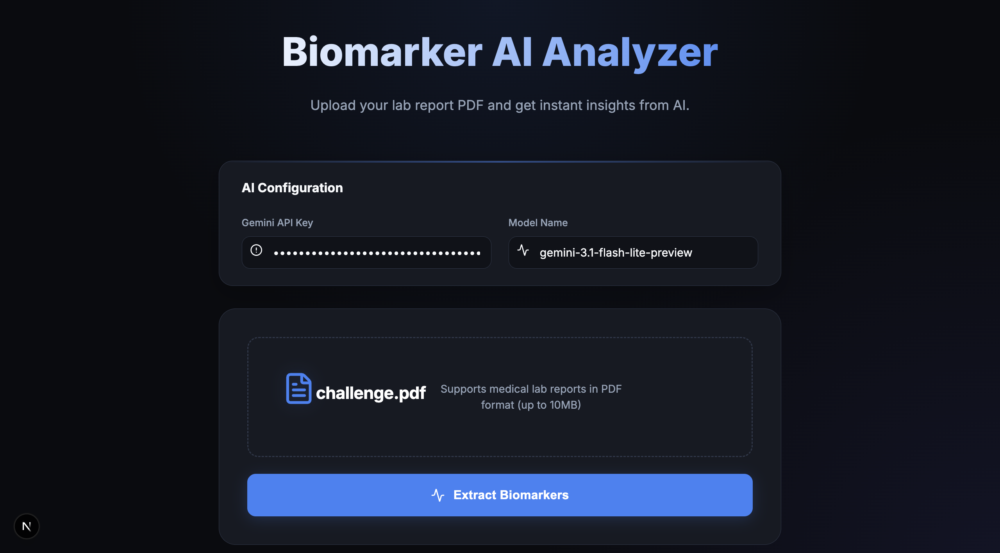

# Biomarker AI Analyzer - Axo Longevity Challenge



## Overview

The **Biomarker AI Analyzer** is a high-performance web application designed for **Axo Longevity**. It leverages the power of Google's **Gemini AI** to process medical lab report PDFs, extract critical biomarkers, and provide clinical insights based on patient demographics.

Developed by **Segni Dessalegn**, a Full Stack Engineer with an AI focus, this project demonstrates a seamless integration of modern web technologies with advanced LLM capabilities to solve real-world healthcare data challenges.

## Key Features

- **PDF Processing**: Seamless drag-and-drop upload for medical lab reports.
- **AI-Powered Extraction**: Automatically extracts patient age, sex, and all biomarkers from unstructured PDF data.
- **Data Standardization**: Converts complex biomarker names and units into standard English formats.
- **Smart Classification**: Categorizes results into "Optimal", "Normal", or "Out of Range" based on clinical reference guidelines tailored to the patient's profile.
- **Dynamic Configuration**: Users can customize the Gemini API key and model (e.g., Gemini 1.5 Flash, Gemini 2.0 Flash) directly from the interface.
- **Premium UI**: A sleek, dark-themed interface built with glassmorphism aesthetics and smooth animations.

## Tech Stack

- **Framework**: [Next.js 15+](https://nextjs.org/) (App Router)
- **Language**: TypeScript
- **AI Engine**: [Google Gemini AI API](https://ai.google.dev/)
- **Styling**: Vanilla CSS (Custom Design System)
- **Animations**: [Framer Motion](https://www.framer.com/motion/)
- **Icons**: [Lucide React](https://lucide.dev/)

## Getting Started

### 1. Prerequisites

- Node.js 18+ installed.
- A Google AI (Gemini) API Key. [Get one here](https://aistudio.google.com/app/apikey).

### 2. Installation

Clone the repository and install dependencies:

```bash
git clone <repository-url>
cd challenge
npm install
```

### 3. Environment Setup

Create a `.env.local` file in the root directory (you can use `.env.example` as a template):

```bash
cp .env.example .env.local
```

Edit `.env.local` and add your Gemini API key:

```env
NEXT_PUBLIC_GEMINI_API_KEY=your_actual_api_key_here
NEXT_PUBLIC_GEMINI_MODEL_NAME=gemini-3.1-flash-lite-preview
```

### 4. Running Locally

Start the development server:

```bash
npm run dev
```

Open [http://localhost:3000](http://localhost:3000) in your browser to see the application.

## About the Developer

**Segni Dessalegn**  
*Full Stack Engineer | AI Focus*

Passionate about building intelligent applications that bridge the gap between complex data and user-friendly interfaces. Specializing in React/Next.js ecosystems and LLM integrations.

---

Designed and Built for **Axo Longevity**.
